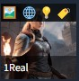

# Civitai Helper
Stable Diffusion Webuiは、Civitaiモデルをより簡単に管理および使用するための拡張機能であるCivitaiヘルパーを提供します。

[Civitai Url](https://civitai.com/models/16768/civitai-helper-sd-webui-civitai-extension)  

# 注意
**このプラグインは現在非常に安定しており、多くの人がうまく使っています。問題が発生した場合は、[よくある質問](#よくある質問)を確認し、コマンドラインウィンドウの詳細を確認してください。**  

# 機能
* 全てのモデルをスキャンし、Civitaiからモデル情報とプレビュー画像をダウンロードする
* CivitaiモデルページのURLを使って、ローカルモデルとCivitaiモデル情報を接続する
* CivitaiモデルページのURLから、モデル（情報とプレビュー画像を含む）をSDディレクトリまたはサブディレクトリにダウンロードする。
* ダウンロードは再開可能
* ローカルモデルとCivitai上の新しいバージョンを一括でチェックする
* 新しいバージョンのモデルを直接SDモデルディレクトリにダウンロードする（情報とプレビュー画像を含む）
* 内蔵の「Extra Network」モデルカードを変更し、各カードに以下の機能ボタンを追加しました。
  - 🖼: 「replace preview」のテキストをこのアイコンに変更
  - 🌐: このモデルのCivitaiページを新しいタブで開く
  - 💡: このモデルのトリガーワードをキーワード入力欄に一括で追加する
  - 🏷: このモデルのプレビュー画像で使用されているキーワードを一括で使用する
* 上記の追加機能ボタンは、サムネイルモードにも対応しています。
* タッチスクリーンユーザー用に、常に表示されるボタンのオプションを追加しました。

# インストール
このプロジェクトをzipファイルでダウンロードし、SD Webuiディレクトリの/extensionsに展開してください。

このプラグインをインストールまたはアップグレードする場合は、SD Webuiを完全に閉じてから再起動する必要があります。UIの再読み込みは機能しません。

# 使用方法

## SD Webuiの更新
この拡張機能には、Extra NetworkのカードリストIDが必要です。これは2023年2月6日にSD Webuiに追加されたものです。

そのため、バージョンが古い場合は、まずSD Webuiを更新する必要があります！

## モデルのスキャン
拡張機能ページ「Civitai Helper」に移動し、「Scan Model」というボタンがあります。   

  

クリックすると、すべてのモデルがスキャンされ、SHA256コードが生成され、civitaiからモデル情報とプレビュー画像を取得するために使用されます。スキャンには時間がかかりますので、しばらくお待ちください。

この拡張機能は、各モデルに対してJSONファイルを作成し、civitaiから取得したモデル情報を保存するために使用します。このファイルは、モデルの同じディレクトリに保存され、名前は「モデル名.civitai.info」となります。  

  

モデル情報ファイルが既に存在する場合、スキャン時にこのモデルはスキップされます。モデルがcivitaiのものでない場合は、空の情報ファイルが作成され、将来の重複スキャンを回避するために使用されます。

### 新しいモデルの追加
新しいモデルをダウンロードした場合は、再度スキャンボタンをクリックするだけで済みます。すでにスキャンされたファイルは再スキャンされず、自動的に新しいモデルの情報とプレビュー画像が取得されます。SD Webuiを再起動する必要はありません。 

## モデルカード
**(スキャンを完了した後にカード機能を使用してください)**    
SD Webuiの組み込み「Extra Network」ページを開き、モデルカードが表示されます。  

  

マウスをモデルカードの下部に移動すると、4つのボタンが表示されます。
  - 🖼: プレビューを置き換えるためのテキストを「replace preview」からこのアイコンに変更します
  - 🌐: このモデルのCivitaiページを新しいタブで開きます
  - 💡: このモデルのトリガーワードをキーワード入力欄に一括追加します
  - 🏷: このモデルのプレビュー画像に使用されているキーワードを一括で使用します
  
  

これらの追加ボタンが表示されない場合は、「Refresh Civitai Helper」をクリックするだけで、ボタンがカードに再追加されます。  

  

Extra Networkが更新されるたびに、余分な変更が削除され、ボタンが消えてしまいます。その場合は、「Refresh Civitai Helper」をクリックして、これらの機能を再度追加する必要があります。

### 小さなプレビューモード
これらの機能ボタンは、小さなプレビューモードをサポートしていますが、SD WebuiのCSSの問題により、現在は常に表示するか、常に非表示にするかのどちらかに制限されています。マウスをスライドして表示することはできません。   
  

## ダウンロード
**(タスクは一つずつ完了してから次のタスクをダウンロードしてください)**  
CivitaiモデルページのURLを使用してモデルをダウンロードするには、3つのステップが必要です。
* URLを入力し、モデル情報を取得するためにボタンをクリックします。
* 拡張機能が自動的にモデル名とタイプを入力します。ダウンロードするサブディレクトリとモデルバージョンを選択する必要があります。
* ダウンロードをクリックします  

ダウンロードプロセスは、コマンドラインインターフェイスに進行状況バーを表示します。
断片的に再開することができ、大きなファイルを心配する必要はありません。  

## バッチでモデルの新バージョンをチェックする
モデルタイプに従って、ローカルモデルを一括してCivitaiの新バージョンをチェックすることができます。複数のモデルタイプを選択できます。  
  

新しいバージョンをチェックすると、各モデルをチェックするたびに1秒の遅延が発生するため、速度がやや遅くなります。  

これは、本プラグインによる一時的なDDosの状況を回避するため、Civitaiを保護するために行われます。一部のクラウドサービスプロバイダーには、「無料ユーザーのAPIリクエストは1秒あたり1回を超えてはいけない」といった保護機構があります。Civitaiにはまだこのような設定がありませんが、我々はそれを自己保護しなければなりません。なぜなら、もしそれがダウンした場合、誰にとっても良いことはありませんから。      

チェックが完了すると、すべての新しいバージョンがUIに表示されます。    

各モデルの新しいバージョンには、3つのリンクがあります。
* 最初のものは、このモデルのWebページです。
* 2つ目は、この新しいバージョンのダウンロードアドレスです。  
* 3つ目は、Python側で新しいバージョンをモデルディレクトリに直接ダウンロードするボタンです。
この方法でダウンロードすると、ダウンロードの詳細が「Download Model」の領域とコマンドラインウィンドウに表示されます。一度に1つのタスクしかサポートされていません。  

## URLからモデル情報を取得する
Civitai上で自分のモデルのSHA256が見つからない場合でも、自分のモデルをCivitaiモデルに接続したい場合は、この拡張機能のページから、モデルをリストから選択し、CivitaiモデルページのURLを提供することができます。  

ボタンをクリックすると、拡張機能はCivitaiモデルの情報をダウンロードし、それをローカルモデルの情報として使用します。  

  

## その他の設定
**「設定を保存」ボタンは、モデルスキャン領域とその他の設定項目の両方を保存します。**  

* 「常にボタンを表示する」は、タッチスクリーンでの操作を容易にするためです。
* 「小さな画像モードで機能ボタンを表示する」は、小さな画像モードでの機能ボタンの表示を切り替えます。 
 

## プレビュー画像
Extra Networkは、2つのプレビュー画像の命名をサポートしています：model_name.pngとmodel_name.preview.png。model_name.pngの優先度が高くなります。

優先度が高いプレビュー画像が存在しない場合は、自動的にmodel_name.preview.pngが使用されます。

これにより、自分で作成したプレビュー画像とネットワークからダウンロードしたプレビュー画像を同時に使用し、自分で作成したプレビュー画像を優先的に使用できます。

## キーワード
カード上の「キーワードを追加」ボタンは、Civitaiプレビュー画像から取得したキーワードであり、自分で作成した画像のキーワードではありません。

Civitaiにはすべての画像にキーワードがあるわけではなく、1つのモデルに含まれるすべてのプレビュー画像のキーワードが同じであるわけでもありません。したがって、ここではすべてのCivitaiプレビュー画像情報を走査し、最初にキーワードがあるものを読み込みます。

## SHA256
ファイルのSHA256を作成するために、プラグインはファイル全体を読み取る必要があります。大きなファイルの場合、処理が遅くなります。

Civitaiで対応するモデルのSHA256が見つからない場合は、次の2つの場合が考えられます：
* 古すぎるモデルで、CivitaiにはSHA256が保存されていません。
* モデルの作成者が静かにモデルファイルを変更しましたが、説明やバージョンを変更していないため、ウェブページではわかりませんが、実際にはCivitaiに保存されているモデルファイルとローカルのモデルファイルが異なるものとなっています。  

これらの場合は、プラグインでモデルページのURLを提供することで、モデル情報ファイルを取得できます。

## よくある質問
### 4つのカードボタンが表示されない
#### 日本語の問題
新しいバージョンをダウンロードしてください。最新バージョンでは、日本語による問題が解決されています。バイリンガルプラグインは、v1.6.1.1以降のバージョンでサポートされるようになりました。 

#### クラウドサービスベースの日本語プラグインを使用しました
クラウドサービスベースの日本語プラグインを使用した場合は、通常の日本語プラグインに変更してください。

#### その他の場合
まず、「Refresh Civitai Helper」ボタンをクリックして更新しましたか。  

それでもこの問題がある場合は、おそらく最新バージョンのSD webuiを使用していないためです。  

SD webuiのファイルを変更した場合、更新操作が失敗する可能性があります。更新が成功したかどうかを確認するには、gitコマンドラインの出力情報を確認する必要があります。  

gitは、多くの場合、アップグレードを拒否し、手動で解決する必要があるいくつかの競合状態を示します。コマンドライン出力を見ない場合、更新が成功したと思うかもしれませんが、実際には成功していません。   

 
### Request model info from civitai
これはcivitaiに接続しています。情報がない場合は接続できないため、プロキシを使用してください。

### スキャンまたはモデル情報の取得に失敗しました
このプラグインは現在非常に安定しているため、この問題の原因は基本的にはCivitaiが接続要求を拒否したためです。  

Civitaiは大きなウェブサイトとは異なり、安定していません。彼らのウェブサイトはダウンしたり、API接続を拒否したり、APIリクエストを人間の確認ページに転送してブロックしたりすることがあります。  

Civitaiには接続プールの設定もあります。基本的に、同時に許可される最大接続数です。この数字に達すると、以降のAPI接続要求はすべて拒否されます。  

そのため、このような場合はしばらく待ってから再試行するしかありません。  

### colabを使用してスキャンに失敗する場合
まず、表示されたエラーメッセージをGoogleで検索してください。おそらく、colabの問題が発生している可能性があります。取得したエラーメッセージをGoogleで検索して、原因を確認してください。  

Google Driveに接続する際には、ファイルへのアクセス数に制限があるため、スキャンが失敗することがよくあります。これはGoogle Driveの制限です。詳細については、インターネットで検索してください。

