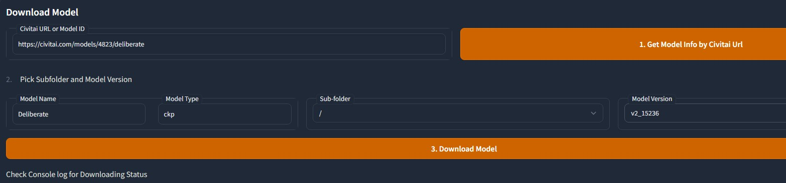

# Civitai Helper
Stable Diffusion Webui는 Civitai 모델을 더 쉽게 관리하고 사용하기 위한 Civitai Assistant 확장 기능입니다.

[Civitai Url](https://civitai.com/models/16768/civitai-helper-sd-webui-civitai-extension)  

# 주의사항
**이 플러그인은 지금 매우 안정적이며 많은 사용자들이 잘 사용하고 있습니다. 문제가 발생하면, [자주 묻는 질문](#자주-묻는-질문)을 먼저 확인하고 명령 프롬프트 창의 세부 정보를 확인하세요.**   

# 기능
* 모든 모델을 스캔하여 Civitai에서 모델 정보 및 미리보기 이미지 다운로드
* Civitai 모델 페이지 URL을 통해 로컬 모델 및 Civitai 모델 정보 연결
* Civitai 모델 페이지 URL을 통해 모델(정보 및 미리보기 이미지 포함) 다운로드하여 SD 디렉토리 또는 하위 디렉토리에 저장
* 이어받기 지원 다운로드
* 로컬 모델에서 Civitai에 새 버전이 있는지 일괄 확인
* 새 버전 모델을 SD 모델 디렉토리에 직접 다운로드(정보 및 미리보기 이미지 포함)
* "Extra Network" 모델 카드 내부를 수정하여 다음과 같은 기능 버튼을 추가:
  - 🖼: "replace preview" 텍스트를 이 아이콘으로 변경
  - 🌐: 해당 모델의 Civitai 페이지를 새 탭에서 열기
  - 💡: 이 모델의 트리거 단어를 키워드 입력란에 일괄 추가
  - 🏷: 이 모델 미리보기 이미지에 사용된 키워드 사용
* 위의 추가 기능 버튼은 썸네일 모드를 지원합니다.
* 터치 스크린 사용자를 위해 항상 표시되는 버튼 옵션 추가

# 설치
이 프로젝트를 zip 파일로 다운로드하고 SD webui 디렉토리/extensions에 압축 해제하면 됩니다.  

이 플러그인을 설치하거나 업그레이드하려면 SD Webui를 완전히 종료하고 다시 시작해야 합니다. UI 다시로드는 작동하지 않습니다.  

# 사용 방법

## SD Webui 업데이트
이 확장 기능은 Extra Network 카드 목록 ID를 가져와야 합니다. 이것은 2023-02-06에 SD Webui에 추가된 것입니다.  

따라서, 만약 사용 중인 버전이 이보다 이전 버전이라면, 먼저 SD Webui를 업데이트해야 합니다!  

## 모델 스캔
확장 페이지 "Civitai Helper"로 이동하고 "Scan Model"이라는 버튼을 클릭합니다.  

  

클릭하면 모든 모델을 스캔하고 SHA256 코드를 생성하여 Civitai에서 모델 정보 및 미리보기 이미지를 가져옵니다. 스캔에는 시간이 걸리므로 인내심을 가지고 기다려주세요.  

이 확장 기능은 각 모델마다 Civitai에서 얻은 모델 정보를 저장하는 JSON 파일을 생성합니다. 이 파일은 모델이 있는 디렉토리에 "모델 이름.civitai.info"라는 이름으로 저장됩니다.  

  

모델 정보 파일이 이미 존재하는 경우 해당 모델은 스캔하지 않습니다. 모델이 Civitai가 아닌 경우 빈 정보 파일이 생성되어 나중에 중복 스캔을 피합니다.  

### 새 모델 추가
새 모델을 다운로드한 후 스캔 버튼을 다시 클릭하면 됩니다. 이미 스캔된 파일은 다시 스캔하지 않으며 새 모델의 정보와 미리보기 이미지를 자동으로 얻을 수 있습니다. SD Webui를 다시 시작할 필요가 없습니다.  

## 모델 카드
**(스캔을 완료한 후에 카드 기능을 사용하세요)**  
SD Webui의 내장 "Extra Network" 페이지를 열어 모델 카드를 표시합니다.  

  

마우스를 모델 카드 아래쪽으로 이동하면 4개의 버튼이 표시됩니다:  
  - 🖼: "replace preview" 텍스트를이 아이콘으로 변경
  - 🌐:이 모델의 Civitai 페이지를 새 탭에서 엽니다.
  - 💡:이 모델의 트리거 단어를 키워드 입력 상자에 추가합니다.
  - 🏷:이 모델 미리보기에 사용되는 키워드를 사용합니다.
  
  

이러한 추가 버튼이 표시되지 않으면 Refresh Civitai Helper를 클릭하여 다시 추가하십시오.  

  

Extra Network가 새로 고침될 때마다이 추가 수정이 제거되므로 버튼이 사라지면 Refresh Civitai Helper를 클릭하여 기능을 다시 추가해야합니다.  

### 작은 미리보기 모드
이러한 기능 버튼은 작은 미리보기 모드를 지원하지만 SD Webui의 CSS 문제로 인해 현재 항상 표시하거나 항상 표시하지 않아야합니다.  
  

## 다운로드
**(한 번에 하나씩, 하나를 다운로드하고 다른 것을 다운로드하세요)**  
Civitai 모델 페이지 URL을 통해 모델을 다운로드하려면 3 단계가 필요합니다:  
* URL을 입력하고 모델 정보를 가져 오는 버튼을 클릭합니다.
* 확장 프로그램이 모델 이름과 유형을 자동으로 입력합니다. 다운로드 할 하위 디렉토리와 모델 버전을 선택해야합니다.
* 다운로드를 클릭하십시오.  

다운로드 과정은 진행률 표시 줄이있는 명령 줄 인터페이스에서 표시됩니다.  
일시 중지 및 다시 시작을 지원하며 대용량 파일도 문제없이 처리합니다.  

## 일괄적으로 모델 새 버전 확인
Civitai에서 새 버전을 확인하기 위해 로컬 모델을 모델 유형 별로 일괄적으로 확인할 수 있습니다. 여러 모델 유형을 선택할 수 있습니다.  
  

새 버전을 확인 할 때마다 모델이 모두 확인 될 때까지 1 초의 지연이 있으므로 속도가 다소 느립니다.  

이것은 Civitai가 이 플러그인으로 인해 일시적으로 DDos와 유사한 상황에 빠지지 않도록 보호하기 위한 것입니다. 일부 클라우드 서비스 제공 업체는 "무료 사용자의 초당 API 요청 수는 1 회를 초과 할 수 없다"는 보호 메커니즘이 있습니다. Civitai는 이러한 설정이 없습니다. 그러나 우리는 여전히 그것을 보호해야합니다. 왜냐하면 그것이 다운되면 모두에게 좋지 않기 때문입니다.     

확인이 완료되면 다음과 같이 UI에 모든 새 버전을 찾은 정보가 표시됩니다.  

각 모델 새 버전에는 3 개의 링크가 있습니다.  
* 첫 번째는 이 모델의 웹 페이지입니다.
* 두 번째는이 새 버전의 다운로드 주소입니다.  
* 세 번째는 버튼입니다. Python 측에서 새 버전을 모델 디렉토리로 직접 다운로드합니다.  
이 방식으로 다운로드하면 "모델 다운로드" 영역과 명령 줄 창에 다운로드 세부 정보가 표시됩니다. 한 번에 하나의 작업만 지원됩니다.  

## URL을 기반으로 모델 정보 가져오기
Civitai에서 모델의 SHA256을 찾을 수 없지만 여전히 Civitai 모델에 모델을 연결하고 싶다면 해당 확장 프로그램 페이지에서 모델을 선택하고 Civitai 모델 페이지의 URL을 제공할 수 있습니다.  

버튼을 클릭하면 확장 프로그램이 해당 Civitai 모델의 정보를 다운로드하여 로컬 모델의 정보로 사용합니다.  

  

## 기타 설정
**설정 저장 버튼은 스캔 모델 영역 및 기타 설정 두 영역의 옵션을 저장합니다.**  

* "항상 표시 버튼"은 터치 스크린에서 편리하게 사용하기 위한 것입니다.  
* "작은 그림 모드에서 기능 버튼 표시"는 작은 그림 모드에서 기능 버튼을 표시할지 여부를 전환합니다.  
 

## 미리보기 이미지
Extra Network는 model_name.png 및 model_name.preview.png 두 가지 미리보기 이미지 이름을 지원합니다. 여기서 model_name.png이 우선순위가 높습니다.  

우선순위가 높은 미리보기 이미지가 없으면 자동으로 model_name.preview.png를 사용합니다.  

이렇게 하면 직접 만든 미리보기 이미지와 인터넷에서 다운로드한 미리보기 이미지를 함께 사용할 수 있으며, 우선순위는 직접 만든 이미지가 높습니다.  

## 키워드
카드에 키워드 추가 버튼은 civitai 미리보기 이미지에서 얻은 키워드를 추가하는 것이며, 사용자가 직접 만든 이미지의 키워드가 아닙니다.  

모든 이미지에 키워드가 있는 것은 아니며, 모델에 따라 미리보기 이미지의 키워드가 모두 같지 않을 수 있습니다. 따라서 여기서는 civitai 모든 미리보기 이미지 정보를 탐색하여 첫 번째 키워드가 있는 이미지를 로드합니다.  

## SHA256
파일의 SHA256을 생성하려면 플러그인에서 전체 파일을 읽어야 합니다. 대형 파일의 경우 시스템이 느려질 수 있습니다.  

SHA256은 civitai에서 해당 모델을 찾을 수 없는 두 가지 경우가 있습니다.
* 너무 오래된 모델이므로 civitai에 SHA256이 저장되어 있지 않습니다.
* 모델 작성자가 모델 파일을 조용히 교체했지만 설명 및 버전을 수정하지 않았습니다. 따라서 웹 페이지에서는 확인할 수 없지만 civitai 및 로컬 모델 파일은 이미 다른 파일입니다.  

이러한 경우에는 플러그인에서 모델 페이지 URL을 제공하여 모델 정보 파일을 얻을 수 있습니다  

## 자주 묻는 질문
### 4개의 카드 버튼이 표시되지 않습니다.
#### 다국어 문제
새 버전을 다운로드하면, 최신 버전에서 한국어 번역으로 인한 문제가 해결되었습니다. 양방향 다국어 플러그인은 v1.6.1.1 이후 버전부터 지원됩니다.

#### 다른 경우
먼저 "Refresh Civitai Helper" 버튼을 클릭하여 Civitai Helper를 새로고침했는지 확인하세요.  

그런 다음 이 문제가 계속되는 경우, 유일한 이유는 최신 버전의 SD webui를 사용하지 않았기 때문입니다.  

만약 SD webui의 파일을 수정했다면, 업데이트 작업이 실패할 수 있습니다. 업데이트가 제대로 이루어졌는지 확인하려면 git 명령 줄의 출력 정보를 확인해야 합니다.  

git은 종종 업그레이드를 거부하고, 일부 충돌을 수동으로 해결해야 한다는 메시지를 보여줍니다. 명령 줄 출력을 확인하지 않으면 업그레이드가 성공했다고 잘못 생각할 수 있습니다.  

 
### Request model info from civitai
이것은 Civitai에 연결하고 있음을 나타내며, 정보가 없으면 연결할 수 없으므로 프록시를 사용해야 합니다.  

### 모델 정보 스캔 또는 가져오기 실패
이 플러그인은 이제 매우 안정적이므로, 이 문제의 원인은 대부분 Civitai가 연결 요청을 거부했기 때문입니다.  

Civitai는 대형 웹사이트와 같이 안정적이지 않습니다. 웹사이트가 다운되거나 API 연결을 거부할 수 있고, API 요청을 실제 검증 페이지로 전환하여 차단할 수도 있습니다.  

Civitai에는 연결 풀 설정이 있습니다. 이는 동시에 허용되는 최대 연결 수입니다. 이 수치에 도달하면 다음 API 연결 요청은 모두 거부됩니다. 이 때는 잠시 기다렸다가 다시 시도해야 합니다.  

또한 국내 사용자들에게는 프록시 문제가 있습니다. 대개는 프록시를 사용해야만 연결할 수 있습니다.  

### Colab 사용시 스캔 실패
먼저 보이는 오류 메시지를 Google에서 검색해보세요. 대개 Colab의 문제일 가능성이 높습니다.  

그리고 Colab이 Google 드라이브에 연결되어 있다면, 파일에 대한 일회성 액세스 제한으로 인해 스캔이 실패할 수 있습니다. 이는 Google 드라이브의 제한 사항으로, 자세한 내용은 Google 검색을 통해 알아보세요.  

