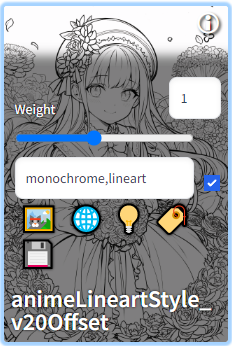
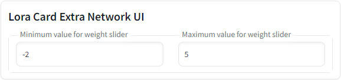
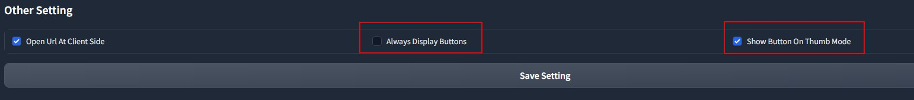

### Language
[中文](README.cn.md)  
[日本語(非公式)](https://economylife.net/civitai-helper-webui-install/)  

# jokker87 additions

You can now set your weight and prompt text on every lora card. To save the settings, click on the disk symbol. you can deactivate prompt text with the checkbox. a fresh scan in the civitai helper tab fills the values of the lora's.

You can set the mininimum and maximum value of the slider in the civitai helper tab.

# Notice
**This extension now is very stable and works well for many people. If you have an issue, read this document and check console log window's detail. I don't have time to explain everything to people again and again.**  

# Stable-Diffusion-Webui-Civitai-Helper
Stable Diffusion Webui Extension for Civitai, to handle your models much more easily.

Civitai: [Civitai Url](https://civitai.com/models/16768/civitai-helper-sd-webui-civitai-extension)  

# Features
* Scans all models to download model information and preview images from Civitai.  
* Link local model to a civitai model by civitai model's url
* Download a model(with info+preview) by Civitai Url into SD's model folder or subfolder.
* Downloading can resume at break-point, which is good for large file. 
* Checking all your local model's new version from Civitai
* Download a new version directly into SD model folder (with info+preview)
* Modified Built-in "Extra Network" cards, to add the following buttons on each card:
  - 🖼: Modified "replace preview" text into this icon
  - 🌐: Open this model's Civitai url in a new tab
  - 💡: Add this model's trigger words to prompt
  - 🏷: Use this model's preview image's prompt
* Above buttons support thumbnail mode of Extra Network
* Option to always show additional buttons, to work with touchscreen.  

# Install
Go to SD webui's extension tab, go to `Install from url` sub-tab.
Copy this project's url into it, click install.  

Alternatively, download this project as a zip file, and unzip it to `Your SD webui folder/extensions`.

Everytime you install or update this extension, you need to shutdown SD Webui and Relaunch it. Just "Reload UI" won't work for this extension.

Done.

# How to Use
## Update Your SD Webui
This extension need to get extra network's cards id. **Which is added to SD webui since 2023-02-06.** 

So, if you are using a version earlier than this, you need to update your SD Webui! 

## Scanning Models
Go to extension tab "Civitai Helper". There is a button called "Scan model".  

Click it and the extension will scan all your models to generate SHA256 hashes, using them to retreive model information and preview images from Civitai.

**Scanning takes time, just wait it finish**

For each model, it will create a json file to save all model info from Civitai. This model info file will be "Your_model_name.civitai.info" in your model folder.

If a model info file already exists, it will be skipped. If a model cannot be found in Civitai, it will create an empty model info file, so the model won't be scanned twice.

### Adding New Models
When you have some new models, just click scan button again, to get new model's information and preview images. It won't scan the same model twice. 

## Model Card
**(Use this only after scanning finished)**   
Open SD webui's build-in "Extra Network" tab, to show model cards.

Move your mouse on to the bottom of a model card. It will show 4 icon buttons:
  - 🖼: Replace preview (a build-in button, modified from text to icon)
  - 🌐: Open this model's Civitai url in a new tab
  - 💡: Add this model's trigger words to prompt
  - 🏷: Use this model's preview image's prompt

**If these additional buttons are not there**, click the `Refresh Civitai Helper` button to bring them back.  

  
Everytime after Extra Network tab refreshed, it will remove all these additional buttons. So, you need to click `Refresh Civitai Helper` button to bring them back.  

### Thumbnail Mode
Additional buttons work on thumbnail too, but due to SD webui's CSS issue, for now, they must be always displayed on thumbnail or don't display at all.   

## Download 
To download a model by Civitai Model Page's Url, you need 3 steps:
* Fill url, click button to get model info
* It will show model name and type automatically. Just choose sub-folder and model version
* Click download.

Detail will be displayed on console log, with a progress bar.   
Downloading can resume from break-point, so no fear for large file.   

## Checking Model's New Version
You can checking your local model's new version from civitai by model types. You can select multiple model types.   
  

The checking process has a "1 second delay" after each model's new version checking request. So it is a little slow.  

This is to protect Civitai from issue like DDos from this extension. Some cloud service provider has a rule as "no more than 1 API request in a second for free user". Civitai doesn't have this rule yet, but we still need to protect it. There is no good for us if it is down.  

**After checking process done**, it will display all new version's information on UI.  

There are 3 urls for each new version. 
* First one is model's civitai page.  
* Second one is new version's download url.    
* Third one is a button to download it into your SD's model folder with python.  
With this one, output information is on "Download Model" section's log and console log. **One task at a time**.  

## Get Model Info By Url
This is used to force a local model links to a Civitai model. For example, you converted a model's format or pruned it. Then it can not be found on civitai when scanning.  

In that case, if you still want to link it to a civitai model. You can use this funcion.   

Choose this model from list, then offer a civitai model page's url.   

After clicking button, extension will download that civitai model's info and preview image for the local file you picked.  

  

## Other Setting
**The Save Setting button, will save both "Scan Model"'s setting and other setting.**  

* "Always Display Button" is good for touch screen.  
* "Show Buttons on Thumb Mode" will turn on/off additional Buttons on thumbnail.  

## Preview Image
Extra network uses both `model_file.png` and `model_file.preview.png` as preview image. But `model_file.png` has higher priority, because it is created by yourself.  

When you don't have the higher priority one, it will use the other automatically.  

## Prompt
When you click the button "Use prompt from preview image", it does not use the prompt from your own preview image. It uses the one from civitai's preview image.  

On civitai, a model's preview images may not has prompt. This extension will check this model's all civitai preview images' information and use the first one has prompt in it.  

## SHA256
To create a file SHA256, it need to read the whole file to generate a hash code. It gonna be slow for large files. 

Also, extension uses Memory Optimized SHA256, which won't stuck your system and works with colab.  

There are 2 cases this hash code can not find the model on civitai:
* Some old models, which do not have SHA256 code on civitai.
* The model's owner changed file on civitai, but does not change version name and description. So, the file on civitai is actually not the one on your manchine.  

In these cases, you can always link a model to civitai by filling its URL in this extension.

## Feature Request
No new feature for v1.x after v1.5. All new feature will go to 2.x.

2.x will focus on custom model information and may change name to "Model Info Helper", because it is not just focus on Civitai anymore. 

From v1.5, v1.x goes into maintenance phase. 

Enjoy!

## Common Issue
### 4 Button on card didn't show
#### Localization
There was a Localization issue if you are not using Englist version of SD webui. This is fixed in the latest version of this extension.

Update to v.1.5.7 to fix it.

#### Other case
First of all, make sure you clicked "Refresh Civitai Helper" button.  

If issue is still there, then, only reason is you are not using the latest SD webui. So, Make sure you updated it.  

Your update could be failed if you have modified SD webui's file. You need to check git command's console log to make sure it is updated. 

In many cases, git will just refuse to update and tell you there are some conflicts need you to handle manually. If you don't check the consloe log, you will think your SD webui is updated, but it is not.  

### Scan or Get model info failed
This extension is stable. So, the reason for this most likely is your request has been refused by Civitai.  

Civitai is not that stable as those rich websites, it can be down, refuse an API connection, or re-direct API request to a real human checking page.  

Also, civitai has a connection pool setting. Basicly, it's a max connection number that civitai can have at the same time. So, if there are already too manny connections on civitai, it will refuse your API connection.  

In those cases, the only thing you can do is just wait a while then try again.  

### Scanning fail when using colab
First of, search your error message with google. Most likely, it will be a colab issue.    

If you are sure it is a out of memory issue when scanning models, and you are using this extension's latest version, then there is nothing we can do.   

Since v1.5.5, we've already optimized the SHA256 function to the top. So the only 2 choices for you are:  
* try again  
* or use a pro account of colab.  

# Change Log
## v1.5.7
* Fix Localization issue for 4 addtional buttons on cards

## v1.5.6
* update error msg when can not connect to civitai API service
* update thumb mode for SD webui new version's metadata button

## v1.5.5
* update SHA256 function, now it just use the code from pip

## v1.5.4
* set sys.stdout to utf-8
* Add default header for requests to prevent from being blocked by civitai.
* merge other v1.5.x change log to v1.5.4
* When downloading a model by url, check if target model version is already existed in user selected sub-folder.
* Support scanning only selected model types. 
* Force TI scanning delay 1 second to prevent from civitai treating this extension's requests as attacking.

## v1.5.0
* Download a model by Civitai model page's url
* Resume downloading from break-point
* Download new version into SD Webui's model folder
* Addtional button now works on thumbnail mode
* Option to always show addtion button, for touch screen.

## v1.4.2
* ignore .vae file in model folder when scanning

## v1.4.1
* When checking new versions, also searching and ignore already existed ones.
* Add version number to the bottom of this extension's tab

## v1.4
* Support checking model's new version, display the result in UI and offer download url
* Remove addintional sub tabs on extension tab. make ui simpler.

## v1.3
* Open url at client side
* Link selected model to civitai by url or model id
* Save and load extension setting to file
* Show button action's output to UI
* Code refactoring

## v1.2.1
* Add more error checking to work with different versions of SD webui. 

## v1.2
* Support customer model folder
* Support readable model info file
* Support download preview image with max size
* Remove card buttons when extra network is in thumbnail mode

## v1.1
* Support subfolders
* Check if refresh is needed when clicking "Refresh Civitai Helper"
* Add space when adding trigger words
* Add memory Optimized sha256 as an option
