# Claim Wall

Since this extension got a little hot, some users come to **claim many other issues to this extension**.   

Following is a wall, to show a few examples how they claim this extension doesn't work, because they don't read document or forget what they did before.  

If you are looking for guideline, go to section [What you should do](#what-you-should-do)  

# Wall

### Didn't even update SD Webui and claim "tried everything"

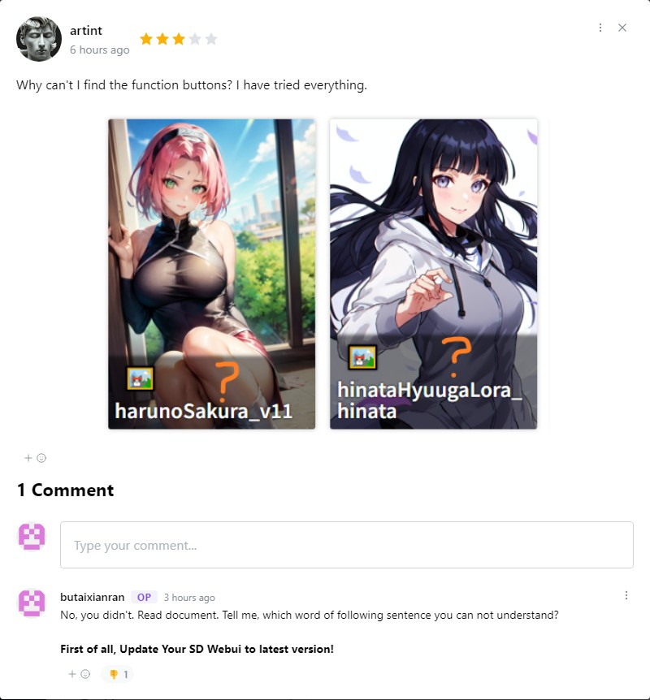  

### Havn't even scanned model
After 4 replies, find that out, and modified his comment.  

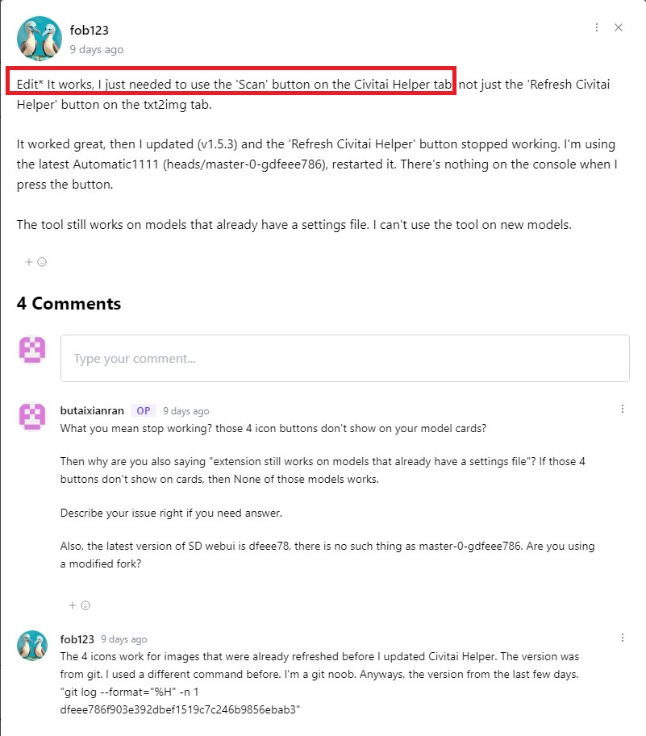  

### Claim "pretty sure" this extension breaks his UI, takes 2days to find out it is not
Then removed his comment from civitai, but his post on reddit is still there, so you can know what's really going on there.  

1. Claim "pretty sure" this extension breaks his UI

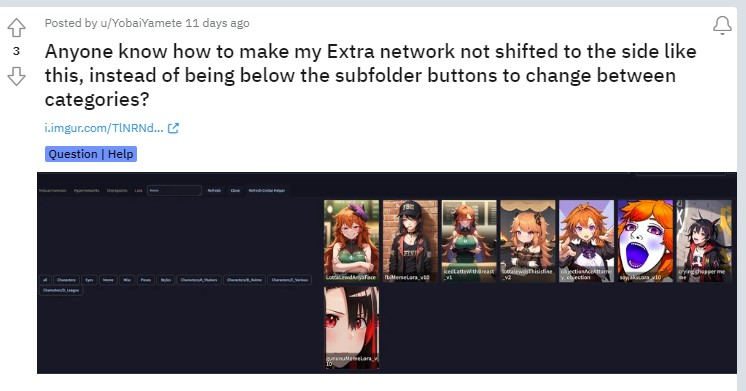  

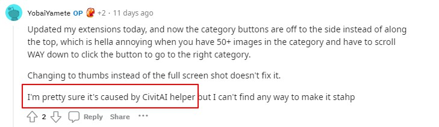  

2. Find out it is not, after 2 days  

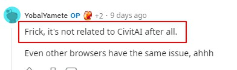  

3. Still don't remember what he did with other extensions, until another user tells him, about 4 days later.  

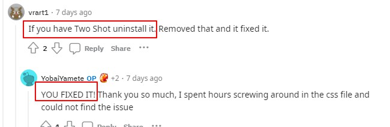  

### **Blame SD Webui's modification to this extension**  
Latest SD webui removed a button from UI, they claim this extension did that, and want it back by this extension  

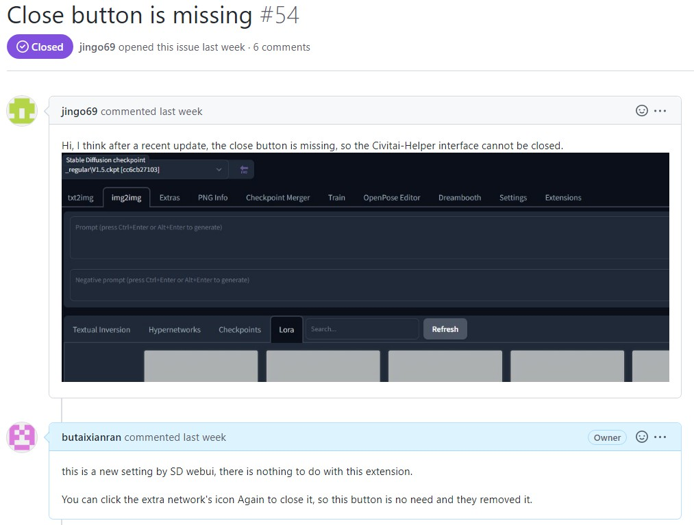  

### Claim other extension's error to this extension
Just because both extensions have "Civitai" in extension's name  

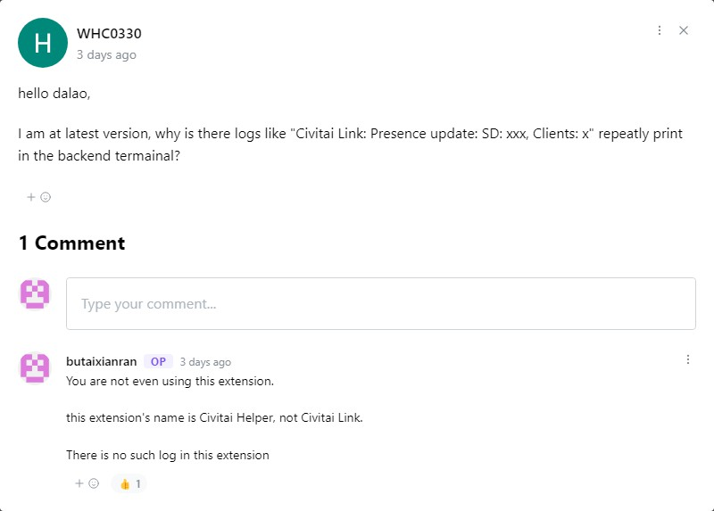   

### **Didn't even use this extension and request a feature it already has**  

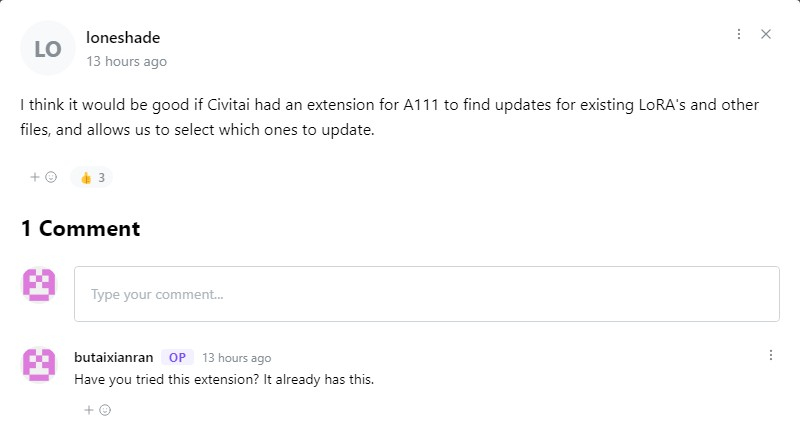  

### **Renamed model folder's name carelessly and forgot that**
Takes about 8 hours to find out why this extension doesn't work on his SDwebui and ready to re-install SD webui from beginning. 

1. claim this extension can not open civitai url on checkpoint models  
  
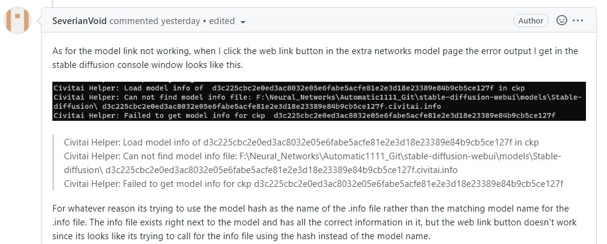  

2. I reply that model he mentioned works well in my SDwebui  
  
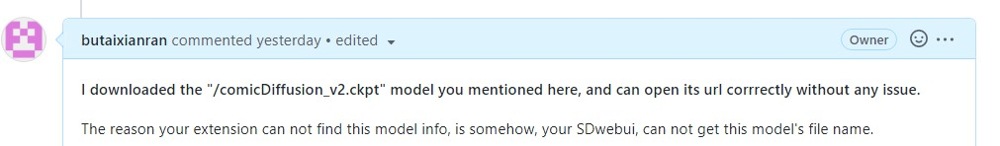  

3. After 6 hours' trying, find out his model folder's name is modified.  
  
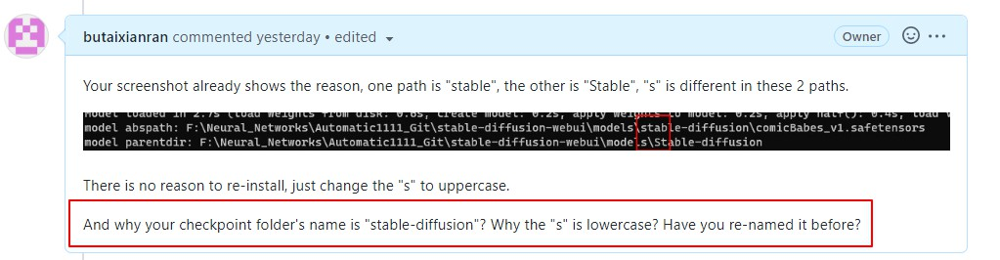  

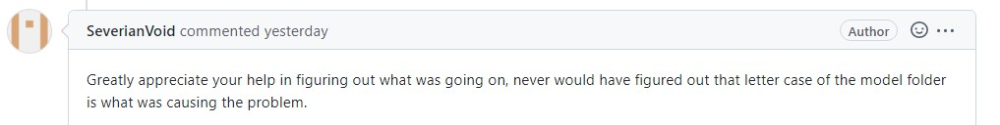  

# What you should do
Above are just a very small piece of this kind of claims. Those claims won't help you. If you have an issue, following is the guidline:   

* If you want to make your extension work, read the document.   

* If your SD webui is broken, before you claim it is caused by this extension, you can disable it and try again.   

* If you followed document, but it still doesn't work well, you can check console log's msg to find out the reason. If you can not understand those msg, you can come and ask for help, with console log's msg or screenshot.    

* If you are using colab, and get an error from colab, then search that error msg in google. Because it's a colab's issue or limitation.    

* If you checked console log window's msg and understand what it means, you are welcome to submit your issue.  

